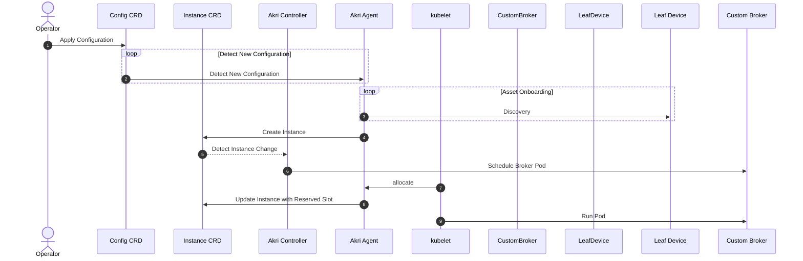

https://mermaid-js.github.io/mermaid/#/./sequenceDiagram

```mermaid
sequenceDiagram
    autonumber
    actor Operator
    participant Config CRD
    participant Instance CRD
    participant Akri Controller
    participant Akri Agent 
    participant kubelet
    participant CustomBroker
    participant LeafDevice
    Operator->>Config CRD: Apply Configuration
    loop Detect New Configuration
        Config CRD->>Akri Agent: Detect New Configuration
    end
    loop Asset Onboarding
        Akri Agent->>Leaf Device: Discovery
    end
    Akri Agent->>Instance CRD: Create Instance
    Instance CRD-->>Akri Controller: Detect Instance Change
    Akri Controller->>Custom Broker:Schedule Broker Pod 
    kubelet->>Akri Agent: allocate
    Akri Agent->>Instance CRD: Update Instance with Reserved Slot
    kubelet->>Custom Broker: Run Pod
   


```
