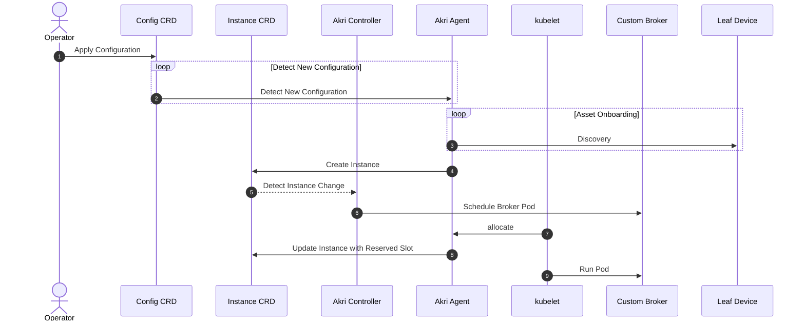
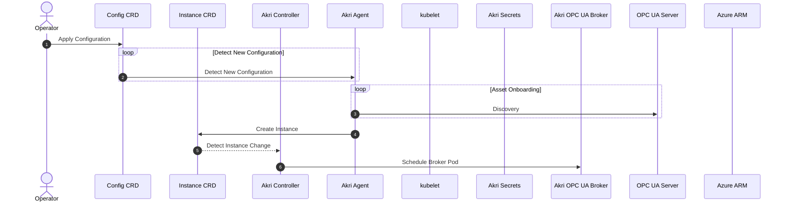
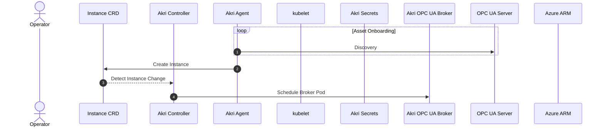
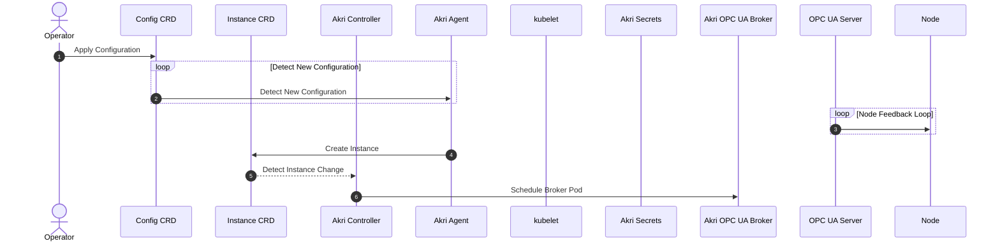
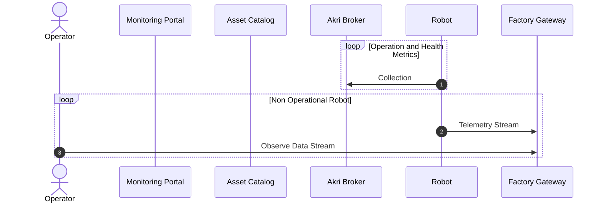

https://mermaid-js.github.io/mermaid/#/./sequenceDiagram

## Onboarding Process

----

## OPC-UA Basic Flow

----

## Asset Management

----

## Assign Permissions for Node

----

## Monitoring A Subset of Nodes

----

## Send Commands To Specific Nodes

